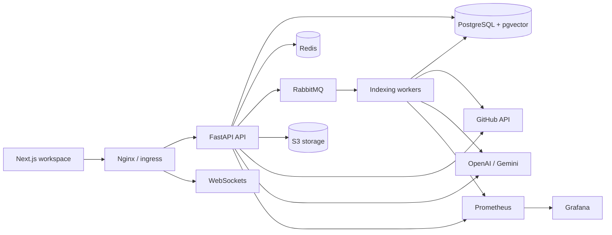

# AI Software Engineering Workspace

Production-grade portfolio project for an AI-assisted software engineering workspace. It demonstrates distributed systems design, clean architecture, authentication, background processing, semantic code search, realtime collaboration, observability, CI/CD, and cloud-ready deployment.

## Stack

- Frontend: Next.js, TypeScript, Tailwind CSS, React Query, Zustand, React Hook Form, Zod
- Backend: FastAPI, SQLAlchemy, Alembic, Pydantic
- Data: PostgreSQL with pgvector, Redis, S3-compatible object storage
- Async: RabbitMQ workers with retry and dead-letter design
- AI: LangGraph-ready service boundary, OpenAI/Gemini provider abstraction
- Integrations: GitHub OAuth and GitHub repository APIs
- Ops: Docker Compose, Kubernetes, Nginx, Prometheus, Grafana, GitHub Actions

## Architecture



## Why These Choices

- Modular monolith first: it is easier to reason about, test, and ship than premature microservices, while the folder boundaries preserve future service extraction.
- PostgreSQL + pgvector first: impressive senior-engineer trade-off because it keeps repository metadata, code chunks, and embeddings transactionally consistent. At very high vector volume, the `VectorStore` adapter can move to Vespa, Milvus, or Pinecone.
- RabbitMQ for workers: durable queue semantics, dead-letter support, backpressure, and clean separation between low-latency API calls and slow GitHub/LLM work.
- Redis for hot-path state only: cache, rate limits, and presence are fast but never become the source of truth.
- Provider adapters for GitHub and LLMs: keeps domain logic testable and avoids hard lock-in to a single AI provider.

## Quick Start

1. Copy `.env.example` to `.env` and fill in GitHub and AI provider keys when needed.
2. Start the full local stack:

```bash
docker compose up --build
```

3. Open:
- Web app: http://localhost:3000
- Nginx edge: http://localhost:8080
- API docs: http://localhost:8000/api/docs
- Grafana: http://localhost:3001
- Prometheus: http://localhost:9090
- RabbitMQ console: http://localhost:15672
- MinIO console: http://localhost:9001

Use `POST /api/v1/auth/signup` from the API docs to create the first account, then sign in through the web UI.

## Feature Map

- GitHub OAuth: `/api/v1/auth/github/url` and callback boundary
- Repository import: `/api/v1/repositories/import`
- Codebase indexing: RabbitMQ worker and `IndexingService`
- Semantic search: `/api/v1/search/semantic`
- AI code chat: `/api/v1/chat`
- PR generation: `/api/v1/pull-requests/generate`
- Test generation: `/api/v1/docs/tests`
- Bug detection: `/api/v1/docs/bugs`
- Documentation generation: `/api/v1/docs/generate`
- Task management: `/api/v1/tasks`
- Realtime collaboration: `/ws/{organization_id}`
- RBAC: role permission matrix in `apps/api/src/ai_workspace_api/core/permissions.py`
- Monitoring: `/metrics`, Prometheus, Grafana datasource
- CI/CD: `.github/workflows/ci.yml`

## Repository Layout

```text
apps/
  api/      FastAPI backend, migrations, tests
  web/      Next.js frontend, UI tests
  worker/   Worker container entrypoint
infra/
  docker/   Nginx, Prometheus, Grafana local config
  k8s/      Kubernetes base and overlays
docs/       Architecture, API, database, deployment, milestones
```

## Documentation

- [Architecture](docs/architecture.md)
- [API](docs/api.md)
- [Database](docs/database.md)
- [Deployment](docs/deployment.md)
- [Developer guide](docs/developer-guide.md)
- [Milestone review notes](docs/milestones.md)
- [Monitoring](docs/monitoring.md)
- [Security](docs/security.md)

## Production Notes

For a real production launch, use managed PostgreSQL, Redis, RabbitMQ or cloud-native queueing, managed object storage, external secret management, TLS through ingress, image signing, SAST/DAST, and a dedicated vector-search service once embedding cardinality becomes a bottleneck.
