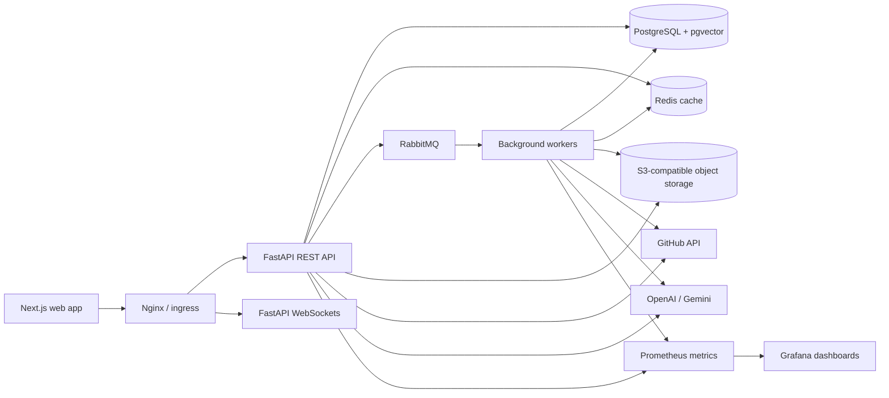
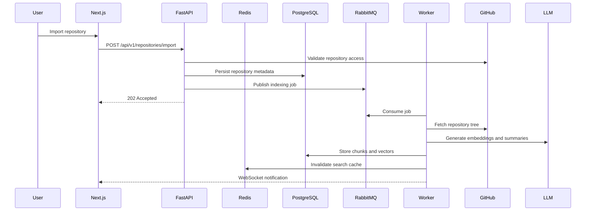
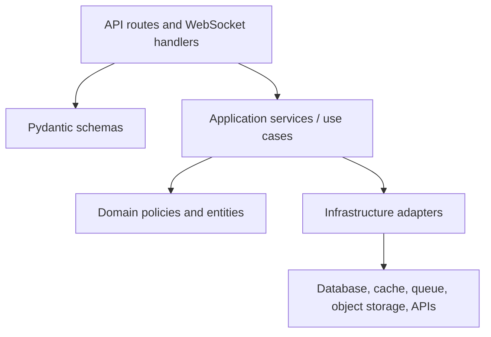
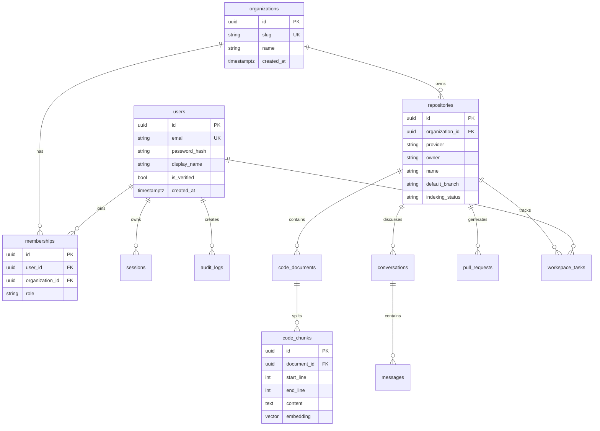

# Architecture

This project is a production-style AI software engineering workspace. It is a modular monorepo designed to run locally with Docker Compose and to deploy to Kubernetes without changing application code.

## High-Level System

## Why This Architecture Impresses Senior Reviewers

- The API is stateless and horizontally scalable; all durable state lives in PostgreSQL, Redis, RabbitMQ, and object storage.
- Repository indexing runs asynchronously through RabbitMQ so user-facing requests are low latency and resilient to LLM or GitHub slowness.
- PostgreSQL with pgvector is selected as the first vector database because it keeps transactional metadata and embeddings close together. At high scale, the same repository abstraction can move to a dedicated vector system such as Milvus, Vespa, or Pinecone.
- Redis is used only for hot-path cache, rate limiting, realtime presence, and idempotency keys; it is not the source of truth.
- Module boundaries mirror likely future services: auth, repositories, indexing, search, chat, pull requests, tasks, docs, realtime, and workers.
- Observability is a first-class concern: structured logs, health checks, readiness probes, Prometheus metrics, and trace-friendly request IDs.

## Request Flow

## Clean Architecture Layers

Routes validate transport concerns only. Services own business rules. Infrastructure adapters isolate GitHub, LLM providers, queueing, storage, cache, and vector search. This makes the system testable and leaves a path to extract services later.

## Data Model

## Low-Latency Choices

- Auth and organization permissions are cached with short TTLs and invalidated on membership changes.
- Search uses pgvector HNSW indexes for approximate nearest neighbor queries.
- Long-running operations return `202 Accepted` and publish worker jobs.
- WebSocket channels carry job progress and presence without polling.
- API pagination uses keyset-friendly IDs and indexed timestamp columns.

